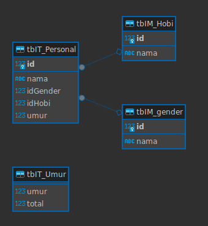

# MVC Project

## About
This project will generate 1000 random data when user click Generate Data button. When user click on Submit button, the data will be saved to SQL Server Database

## ER Diagram


## Run the Project
Make sure you have .NET 8.0 SDK installed (https://dotnet.microsoft.com/download/dotnet/8.0) and run this command on terminal
```
dotnet watch -lp https
```